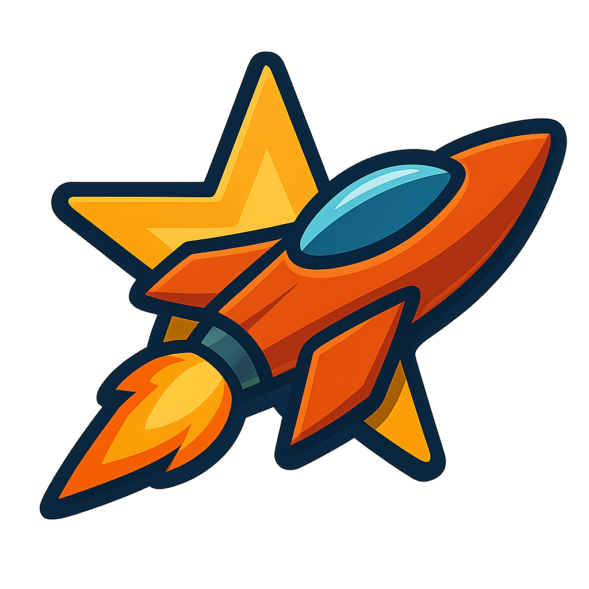

<div align="center">

</div>
<div align="center">
<h1 style="border-bottom: none;">STARBLITZ ASSAULT</h1>
</div>

## Preview

<div style="position:relative; padding-bottom:56.25%; height:0; overflow:hidden;">
  <iframe src="https://www.youtube.com/embed/YEJyiOIQ3wY"
          style="position:absolute; top:0; left:0; width:100%; height:100%;"
          frameborder="0"
          allow="accelerometer; autoplay; clipboard-write; encrypted-media; gyroscope; picture-in-picture"
          allowfullscreen>
  </iframe>
</div>

## Overview

Starblitz Assault is a high-intensity side-scrolling survival wave shooter where players pilot the advanced Starblitz fighter through hostile alien-infested galaxies. As humanity's last defense against cosmic annihilation, you'll navigate bullet-storm chaos, upgrade devastating weapons, and face off against a massive boss in this adrenaline-fueled arcade experience.

The game features:

- Fast-paced side-scrolling shooter gameplay with smooth, responsive controls
- Multiple enemy types with unique attack patterns and behaviors
- A spectacular boss battle with multi-phase challenge
- Dynamic backgrounds with parallax scrolling effects
- Progressive difficulty scaling to maintain challenge
- Extensive powerup system with 11 different upgrade types
- A modern pixel art aesthetic with fluid animations

## Feel The Vibes

This entire game was vibe coded — stitched together by instinct, stubbornness, scotch, and a string of late-night hunches. No Gantt charts. No scrum boards.  Just vibes.

## Contributors

### Meat-Based Leadership
[github.com/psykadel](https://github.com/psykadel)

### Robot Servants
This game was created with assistance from the following digital co-vibers:

| Role | Robo-servant |
|------|-------------|
| **Creative Code Development** | Anthropic Claude Sonnet 3.7 |
| **Bug Fixes & Optimization** | Google Gemini 2.5 Experimental |
| **Sprite & Visual Design** | OpenAI GPT-4o Native Image Generation |
| **Soundtrack Generation** | Udio |
| **Sound Effects Creation** | ElevenLabs |

### Third Parties

Starblitz Assault comes to life thanks to Pygame, a Python game dev toolkit that vibes hard with retro energy and modern flexibility.

## Installation

### Pre-built Releases (Recommended)

For Windows and macOS users, we provide pre-built releases that don't require Python installation:

1. Visit the [Releases](https://github.com/psykadel/StarblitzAssault/releases) section of this repository
2. Download the appropriate file for your system.
3. Follow the simple instructions in the release notes.

### From Source

```bash
# Clone the repository
git clone https://github.com/psykadel/StarblitzAssault.git
cd StarblitzAssault

# Create a virtual environment
python -m venv .venv

# Activate the virtual environment
# On Windows:
.venv\Scripts\activate
# On macOS/Linux:
source .venv/bin/activate

# Install dependencies
pip install -r requirements.txt

# Run the game
python main.py
```

## Gameplay

### Controls

- **Arrow Keys**: Navigate your ship
- **Space**: Fire weapons
- **B**: Deploy Scatter Bomb (when available)
- **M**: Toggle music pause/play
- **+/-**: Adjust music volume
- **ESC**: Quit the game

## License & Attributions

This project is licensed under the MIT License - see the LICENSE file for details.

**Music**   
"Created with Udio" – generated on Udio (free tier) under its attribution policy. 
 
**Sound Effects**   
"Audio generated via elevenlabs.io / 11.ai" – created with ElevenLabs (free tier) under its attribution policy.

**NumPy**  
Harris, C. R., Millman, K. J., van der Walt, S. J., et al. (2020). *Array programming with NumPy*. _Nature_, 585(7825), 357–362. [https://doi.org/10.1038/s41586-020-2649-2](https://doi.org/10.1038/s41586-020-2649-2)

**Pillow**  
Clark, A. (2024). *Pillow (Version 11.2.1)* [Computer software]. [https://github.com/python-pillow/Pillow](https://github.com/python-pillow/Pillow)

**Pydub**  
Robertson, J. (2021). *Pydub (Version 0.25.1)* [Computer software]. [https://github.com/jiaaro/pydub](https://github.com/jiaaro/pydub)

**Pygame**  
Pygame Community. (2025). *Pygame (Version 2.6.1)* [Computer software]. [https://www.pygame.org/](https://www.pygame.org/)

**PyInstaller**  
PyInstaller Development Team. (2025). *PyInstaller (Version 6.13.0)* [Computer software]. [https://pyinstaller.org/](https://pyinstaller.org/)
